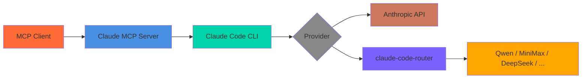

# Claude MCP Server

An MCP server that wraps the [Claude Code CLI](https://docs.anthropic.com/en/docs/claude-code), letting any MCP-compatible client (Claude Code, Cursor, VS Code) call Claude programmatically — with session continuity, model selection, and optional routing to alternative providers via [claude-code-router](https://github.com/musistudio/claude-code-router).



## Quick Start

### 1. Install Claude Code CLI

```bash
npm i -g @anthropic-ai/claude-code
```

Authenticate with your Anthropic API key:

```bash
claude login
# or
export ANTHROPIC_API_KEY="sk-ant-..."
```

### 2. Add to Claude Code

```bash
claude mcp add claude-cli -- npx -y claude-mcp-server
```

### 3. Start Using

```
Ask claude to explain this function
Use claude to refactor this code for better performance
Use review to check my uncommitted changes
```

---

## API Keys & Provider Configuration

### Default: Anthropic API

Set your Anthropic API key in the environment before starting your MCP client:

```bash
export ANTHROPIC_API_KEY="sk-ant-..."
```

Or pass it directly to the MCP server process via your client's settings (see [MCP server env config](#mcp-server-env-config) below).

---

### Alternative Providers via claude-code-router

[claude-code-router](https://github.com/musistudio/claude-code-router) acts as a transparent proxy that intercepts Claude Code CLI requests and routes them to any OpenAI-compatible provider. This lets you use Qwen, MiniMax, DeepSeek, or any other compatible model — without changing your MCP client.

**1. Install and configure the router:**

```bash
npm i -g claude-code-router
```

Add your provider keys to `~/.claude-code-router/config.json`:

```json
{
  "providers": {
    "openrouter": {
      "api_base_url": "https://openrouter.ai/api/v1",
      "api_key": "sk-or-..."
    },
    "deepseek": {
      "api_base_url": "https://api.deepseek.com/v1",
      "api_key": "sk-..."
    },
    "minimax": {
      "api_base_url": "https://api.minimax.chat/v1",
      "api_key": "..."
    },
    "ollama": {
      "api_base_url": "http://localhost:11434/v1",
      "api_key": "ollama"
    }
  },
  "routing": {
    "default": "openrouter/qwen/qwen-2.5-coder-32b-instruct"
  }
}
```

**2. Start the router:**

```bash
ccr start
# Router runs on http://localhost:3000 by default
```

**3. Call with `routerBaseUrl`:**

```
Use claude with routerBaseUrl "http://localhost:3000" and model "qwen/qwen-2.5-coder-32b-instruct" to refactor this file
```

The `routerBaseUrl` param overrides `ANTHROPIC_BASE_URL` for that single call — the main Claude instance is unaffected.

---

### MCP Server Env Config

To set a fixed provider for all calls (no per-call override needed), configure the env in your MCP client settings.

**Claude Code** (`~/.claude/settings.json`):

```json
{
  "mcpServers": {
    "claude-mcp-server": {
      "command": "npx",
      "args": ["-y", "claude-mcp-server"],
      "env": {
        "ANTHROPIC_API_KEY": "sk-ant-...",
        "ANTHROPIC_BASE_URL": "https://openrouter.ai/api/v1",
        "CLAUDE_DEFAULT_MODEL": "qwen/qwen-2.5-coder-32b-instruct"
      }
    }
  }
}
```

**Cursor / VS Code** — add the same `env` block in your MCP server configuration panel.

---

## Tools

| Tool | Description |
|------|-------------|
| `claude` | Execute Claude Code CLI in non-interactive mode — with session support, model selection, tool allowlists, and optional provider routing |
| `review` | AI-powered code review — pass uncommitted changes, branch diffs, or commit diffs as context to Claude |
| `listSessions` | View active conversation sessions |
| `ping` | Test server connection |
| `help` | Get Claude Code CLI help |

### `claude` Parameters

| Parameter | Type | Description |
|-----------|------|-------------|
| `prompt` | string | **Required.** The task or question |
| `model` | string | Model to use (default: `claude-sonnet-4-6`) |
| `sessionId` | string | Session ID for multi-turn conversations |
| `resetSession` | boolean | Clear session history before this call |
| `workingDirectory` | string | Working directory (passed via `--cwd`) |
| `outputFormat` | `text` \| `json` \| `stream-json` | Response format (default: `json`) |
| `maxTurns` | number | Max agentic turns before stopping |
| `allowedTools` | string | Comma-separated tools to allow (e.g. `"Bash,Read,Write"`) |
| `dangerouslySkipPermissions` | boolean | Skip permission prompts |
| `routerBaseUrl` | string | Override `ANTHROPIC_BASE_URL` for this call (e.g. `http://localhost:3000`) |

---

## Examples

**Code analysis:**
```
Use claude to analyze this authentication logic for security issues
```

**Multi-turn conversations:**
```
Use claude with sessionId "refactor" to analyze this module
Use claude with sessionId "refactor" to implement your suggestions
```

**Code review:**
```
Use review with base "main" to check my PR changes
Use review with uncommitted true to review my local changes
```

**Route to an alternative model:**
```
Use claude with routerBaseUrl "http://localhost:3000" and model "deepseek/deepseek-coder-v2" to solve this algorithm
```

**Restrict tools for safe execution:**
```
Use claude with allowedTools "Read,Glob,Grep" to audit this codebase
```

---

## Available Claude Models

| Model ID | Description |
|----------|-------------|
| `claude-sonnet-4-6` | Default — balanced speed and capability |
| `claude-opus-4-6` | Most capable |
| `claude-haiku-4-5-20251001` | Fastest and most compact |

When using `routerBaseUrl`, pass any model ID supported by your provider (e.g. `qwen/qwen-2.5-coder-32b-instruct`, `deepseek/deepseek-coder-v2`).

---

## Requirements

- **Claude Code CLI** — Install with `npm i -g @anthropic-ai/claude-code`
- **Anthropic API key** — Or any OpenAI-compatible provider key via [claude-code-router](https://github.com/musistudio/claude-code-router)

---

## Environment Variables

| Variable | Description |
|----------|-------------|
| `ANTHROPIC_API_KEY` | Anthropic API key (or your provider's key when using `ANTHROPIC_BASE_URL`) |
| `ANTHROPIC_BASE_URL` | Override API base URL (e.g. router URL or compatible provider endpoint) |
| `CLAUDE_DEFAULT_MODEL` | Default model when `model` param is not specified |

---

## Development

```bash
npm install    # Install dependencies
npm run dev    # Development mode
npm run build  # Build for production
npm test       # Run tests
```

---

## Related Projects

- **[claude-code-router](https://github.com/musistudio/claude-code-router)** — Route Claude Code CLI requests to any OpenAI-compatible provider
- **[gemini-mcp-server](https://github.com/tuannvm/gemini-mcp-server)** — MCP server for Gemini CLI

## License

ISC
